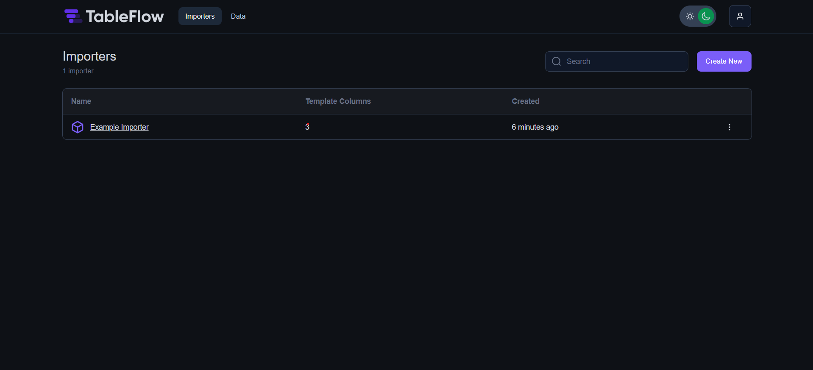
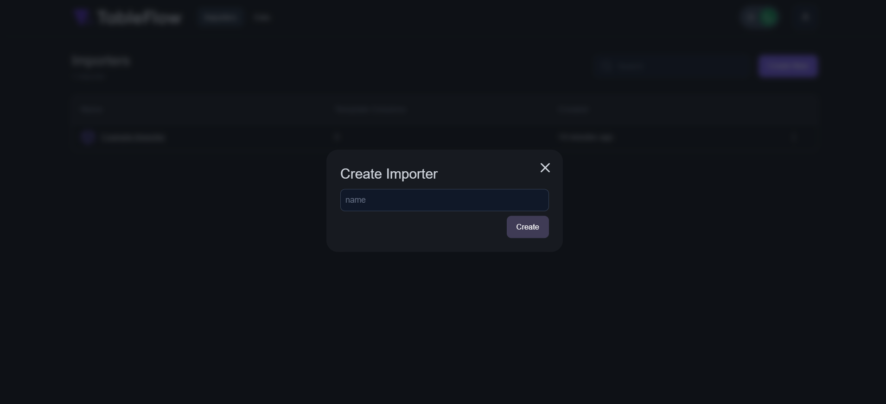
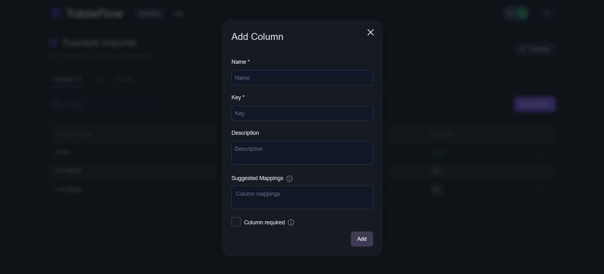
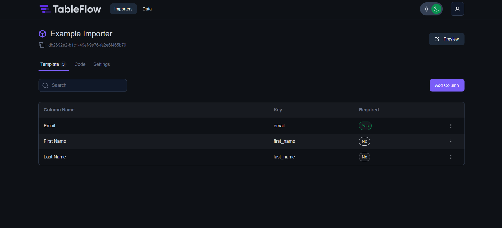
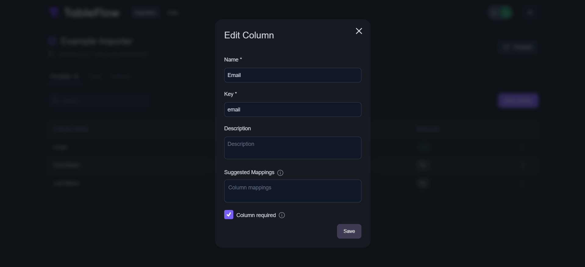
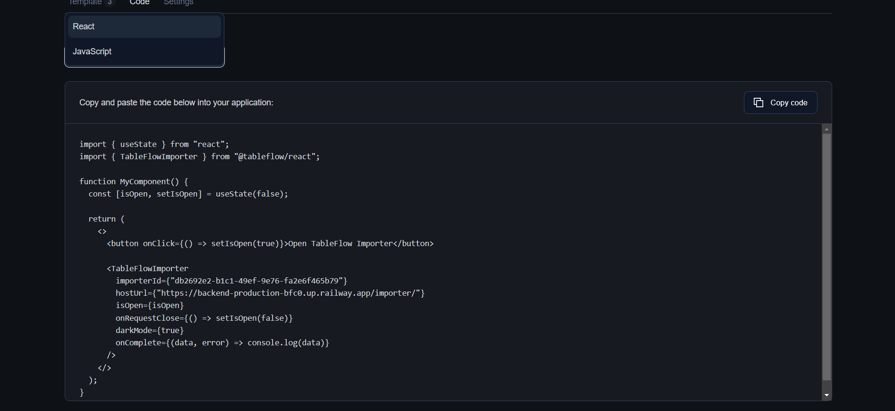

# Tableflow - Railway Template

This example template to deploy a self-hosted version of [Tableflow](https://tableflow.com/). 

## What is Typebot?
TableFlow is a powerful data management and visualization tool designed to streamline your data processing needs. Whether you're a business user, data analyst, or developer, TableFlow provides a user-friendly interface and robust backend services to simplify data organization, transformation, and visualization. This README will guide you through TableFlow's features, services, and how to get started.

## Features
TableFlow offers a wide range of features to help you manage and work with your data effectively:

- Admin UI: A user-friendly web-based administration interface to manage your data tables, users, and permissions.
- Backend Services: A powerful backend that handles data storage, retrieval, and processing.
- Importers: Built-in and customizable data importers to easily bring data into TableFlow.
- Data Manipulation: Tools for data cleaning, transformation, and manipulation.
- Visualization: Create stunning visualizations to gain insights from your data.
- Collaboration: Share data tables and visualizations with team members.
- Permissions: Fine-grained access control to protect sensitive data.
- Export: Export data tables and visualizations in various formats.
- Customization: Customize the appearance and behavior of your tables and visualizations.
- Automation: Automate repetitive tasks using scripting and scheduling.

## ✨ Services

- Admin UI
- Backend
- Importer UI

## 💁‍♀️ How to use

- Click the Railway button 👆
- Add the required environment variables. 
- Deploy
- Once scylla DB is deployed and running, you should get TCP proxy URL in settings -> public networking. Copy the URL and update the backend service environment variables and make sure to redeploy the service to make it work as expected.
- Access the Admin UI by navigating to "http://\<PROJECT_URL\>.up.railway.dev/". 

- You can create a new importer by clicking on the "Create New" button on the top right corner.

- You can add necessary infomration and add new columns to importer based on the data type you want to import.

- You can view the created importer by clicking on the importer name .

- Once you save the importer, you can also modify the columns which you created.

- Table flow also giving example code block which you can add into your website to use the importer.

- Tableflow importer gives option to import CSV data but right now that feature is not working on Railway. We are working on a fix for this. Check the Known Issues section below.
- Enjoy 🎉

## 📝 Notes

- Source repo: https://github.com/tableflowhq/tableflow
- Docs: https://tableflow.com/docs/introduction